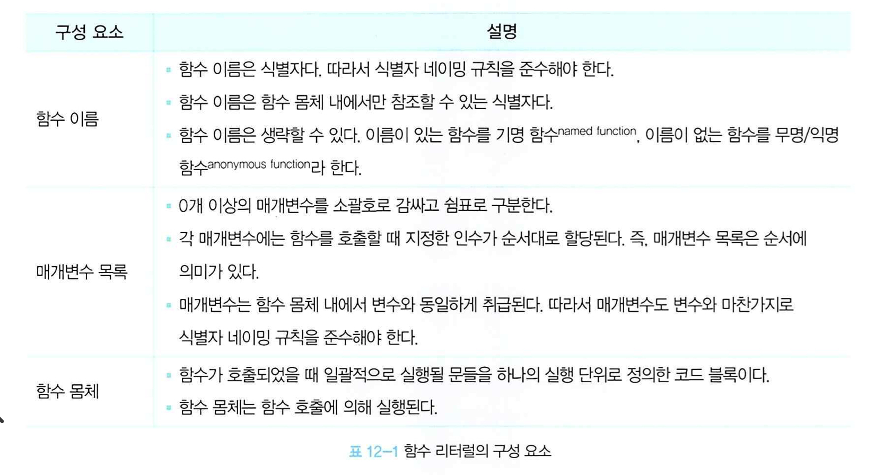

# 12 함수

## 12.1 함수란?

함수는 자바스크립트에서 가장 중요한 핵심 개념이다.

&#x20;프로그래밍 언어의 함수는 **일련의 과정을 문statement으로 구현하고 코드 블록으로 감싸서 하나의 실행 단위로 정의**한 것이다.&#x20;

함수 내부로 입력을 전달하는 변수를 **\[매개변수]parameter**, 매개변수에 입력되는 것을 **\[인수]argument,** 출력을 **\[반환 값]return value**이라고 한다.

함수는 **\[함수 정의]function definition**를 통해 생성되며, 정의 이후에 인수를 전달하며 실행을 명시적으로 지시하는 과정인 **\[함수 호출]function call/invoke**시 함수가 실행된다.

## 12.2 함수를 사용하는 이유&#x20;

함수는 필요할 때 여러 번 호출할 수 있으며 **코드의 재사용**이라는 측면에서 매우 유용하다.&#x20;

또한 코드의 재사용을 높이는 함수는 **유지보수의 편의성**을 높이고 실수를 줄여 **코드의 신뢰성**을 높이는 효과가 있다.

함수는 객체 타입의 값이기에 이름(**식별자**)가 존재하고 적절한 함수 이름은 **코드의 가독성**을 높인다.

## 12.3 함수 리터럴

함수는 객체 타입의 값이다. 숫자 값은 숫자 리터럴로 생성하고 객체를 객체 리터럴로 생성하는 것처럼 함수도 함수 리터럴로 생성할 수 있다.

<figure><figcaption><p>함수 리터럴의 구성요소</p></figcaption></figure>

함수 리터럴은 평가되어 객체 값을 생성한다. 즉 **함수는 객체다.** 하지만 일반 객체는 호출할 수 없지만 함수는 호출할 수 있다는 차이가 있다. 함수가 객체라는 사실은 다른 프로그래밍 언어와 구별되는 자바스크립트의 중요한 특징이다. [18장 '함수와 일급 객체'](18.md)에서 자세히 다룬다.

## 12.4 함수 정의&#x20;

함수 정의 방식은 크게 네가지가 있다.&#x20;

1. 함수 선언문
2. 함수 표현식
3. Function 생성자 함수
4. 화살표 함수 (ES6)

모든 방식은 함수를 정의한다는 공통점이 있지만 미묘한 차이점이 존재한다.&#x20;

### 12.4.1 함수 선언문&#x20;

```javascript
// 함수 선언문
function add(x, y) {
  return x + y;
}

// 함수 참조
// console.dir은 console.log와는 달리 함수 객체의 프로퍼티까지 출력한다.
// 단, Node.js 환경에서는 console.log와 같은 결과가 출력된다.
console.dir(add); // ƒ add(x, y)

// 함수 호출
console.log(add(2, 5)); // 7
```

함수 선언문은 함수 리터럴과 형태가 동일하다. **다만 함수 리터럴은 이름을 생략할 수 있으나 함수 선언문은 함수 이름을 생략할 수 없다.**

함수 선언문은 표현식이 아닌 문이다. ->따라서 개발자도구에서 undefined가 출력된다.

* 표현식이 아닌 문은 변수에 할당될 수 없지만 아래 코드를 보면 변수에 할당되는 것처럼 보인다. 이는 자바스크립트 엔진이 코드의 문맥에 따라 동일한 함수 리터럴을 '표현식이 아닌 문'인 함수 선언문으로 해석하는 경우와 '표현식인 문'인 함수 리터럴 표현식으로 해석하는 경우가 있기 때문이다.&#x20;

```javascript
// 함수 선언문은 표현식이 아닌 문이므로 변수에 할당할 수 없다.
// 하지만 함수 선언문이 변수에 할당되는 것처럼 보인다.
var add = function add(x, y) {
  return x + y;
};

// 함수 호출
console.log(add(2, 5)); // 7
```

* 함수 이름은 함수 몸체 내에서만 참조할 수 있는 식별자다. 따라서 아래 예제 bar 함수는 식별자가 없기에 호출할 수 없다.&#x20;
* 하지만 첫 번째 **함수 선언문**으로 정의된 함수 foo는 호출할 수 있다. foo는 자바스크립트 엔진이 암묵적으로 생성한 식별자이기에 호출이 가능하다. 즉, 함수 이름으로 호출된 것처럼 보이지만 식별자로 호출된 것이다.

```javascript
// 기명 함수 리터럴을 단독으로 사용하면 함수 선언문으로 해석된다.
// 함수 선언문에서는 함수 이름을 생략할 수 없다.
function foo() { console.log('foo'); }
foo(); // foo

// 함수 리터럴을 피연산자로 사용하면 함수 선언문이 아니라 함수 리터럴 표현식으로 해석된다.
// 함수 리터럴에서는 함수 이름을 생략할 수 있다.
(function bar() { console.log('bar'); });
bar(); // ReferenceError: bar is not defined
```

### 12.4.2 함수 표현식 


##

